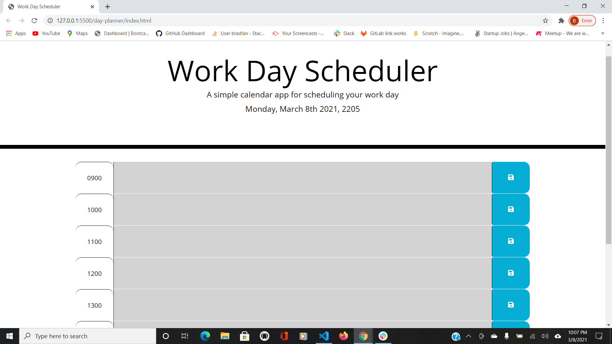

This desktop app was a bootcamp homework assignment which would run in the browser and feature dynamically updated HTML and CSS powered by jQuery. It allows the user to add appointments and everyday tasks to a day planner; the individual slots change color depending on whether the user input is in the past, present or future. This app utilizes local storage so the tasks will not disappear as the screen is refreshed; this also requires the user to delete the current input, add new input and click the save button to override the previous info.

