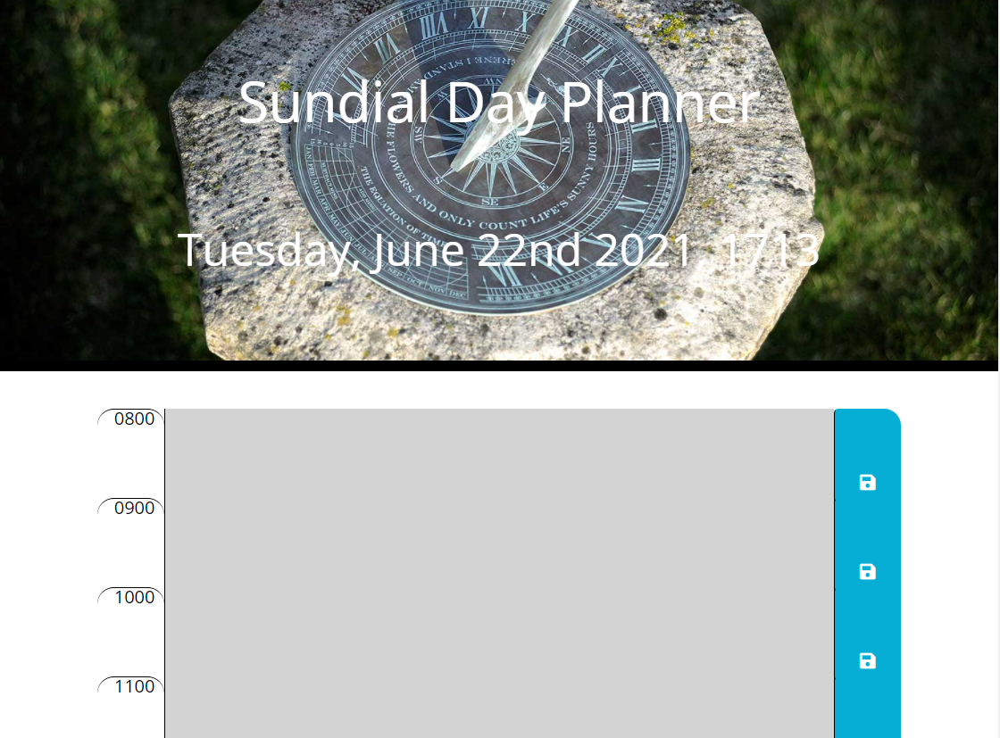

Link to deployed apllication: https://bradfan.github.io/day-planner/

Link to Github repo: https://github.com/bradfan/day-planner

This desktop app was originally a homework assignment which would run in the browser and feature dynamically updated HTML and CSS powered by jQuery. It allows the user to add appointments and everyday tasks to a day planner; the individual slots change color depending on the time of day, reflecting past, present or future. This app utilizes local storage so the tasks will not disappear as the screen is refreshed; this also requires the user to delete the previous input; new appointments are then added and saved by clicking on the save button.

